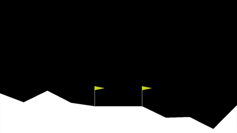

# Reinforcement Learning Specialization

[Reinforcement Learning Specialization](https://www.coursera.org/specializations/reinforcement-learning) by University of Alberta & Alberta Machine Intelligence Institute on Coursera.

<video width="80%" controls><source src="./ImplementYourAgent.mp4" type="video/mp4"></video>

## About this Specialization

> The Reinforcement Learning Specialization consists of 4 courses exploring the power of adaptive learning systems and artificial intelligence (AI).

> Harnessing the full potential of artificial intelligence requires adaptive learning systems. Learn how Reinforcement Learning (RL) solutions help solve real-world problems through trial-and-error interaction by implementing a complete RL solution from beginning to end.

> By the end of this Specialization, learners will understand the foundations of much of modern probabilistic artificial intelligence (AI) and be prepared to take more advanced courses or to apply AI tools and ideas to real-world problems. This content will focus on “small-scale” problems in order to understand the foundations of Reinforcement Learning, as taught by world-renowned experts at the University of Alberta, Faculty of Science.

> The tools learned in this Specialization can be applied to game development (AI), customer interaction (how a website interacts with customers), smart assistants, recommender systems, supply chain, industrial control, finance, oil & gas pipelines, industrial control systems, and more.

## Programming Assignments

- Course 1: Fundamentals of Reinforcement Learning

  - [Learning Objectives](https://github.com/romerik/Reinforcement_Learning/blob/main/1-Fundamentals_of_Reinforcement_Learning/Fundamentals-of-Reinforcement-Learning_-Learning-Objectives-.pdf)

  - [Bandits and Exploration / Exploitation](https://github.com/romerik/Reinforcement_Learning/blob/main/1-Fundamentals_of_Reinforcement_Learning/1-bandits-and-exploration-exploitation/Assignment1.ipynb)
  
  - [Optimal Policies with Dynamic Programming](https://github.com/romerik/Reinforcement_Learning/blob/main/1-Fundamentals_of_Reinforcement_Learning/2-DynamicProgramming/Assignment2.ipynb)

- Course 2: Sample-based Learning Methods

  - [Learning Objectives](https://github.com/romerik/Reinforcement_Learning/blob/main/2-Sample_based_Learning_Methods/Course-2_-Sample-Based-Learning-Methods-Learning-Objectives-.pdf)
  
  - [Practice Assignment 1 - Blackjack](https://github.com/romerik/Reinforcement_Learning/blob/main/2-Sample_based_Learning_Methods/1-Blackjack/Blackjack.ipynb)
  
  - [Policy Evaluation with Temporal Difference Learning](https://github.com/romerik/Reinforcement_Learning/blob/main/2-Sample_based_Learning_Methods/2-Policy%20Evaluation%20with%20Temporal%20Difference%20Learning/assignment.ipynb)
  
  - [Q-Learning and Expected Sarsa](https://github.com/romerik/Reinforcement_Learning/blob/main/2-Sample_based_Learning_Methods/3-Q-Learning%20and%20Expected%20Sarsa/assignment.ipynb)
  
  - [Dyna-Q and Dyna-Q+](https://github.com/romerik/Reinforcement_Learning/blob/main/2-Sample_based_Learning_Methods/4-Dyna-Q/assignment.ipynb)

- Course 3: Prediction and Control with Function Approximation

  - [Learning Objectives](https://github.com/romerik/Reinforcement_Learning/blob/main/3-Prediction_And_Control_With_Function_Approximation/Prediction-and-Control-with-Function-Approximation-Learning-Objectives.pdf)
  
  - [TD with State Aggregation](https://github.com/romerik/Reinforcement_Learning/blob/main/3-Prediction_And_Control_With_Function_Approximation/1-StateAgg/assignment.ipynb)
  
  - [Semi-gradient TD with a Neural Network](https://github.com/romerik/Reinforcement_Learning/blob/main/3-Prediction_And_Control_With_Function_Approximation/2-TD-NN/assignment.ipynb)
  
  - [Function Approximation and Control](https://github.com/romerik/Reinforcement_Learning/blob/main/3-Prediction_And_Control_With_Function_Approximation/3-Control/assignment.ipynb)
  
  - [Average Reward Softmax Actor-Critic](https://github.com/romerik/Reinforcement_Learning/blob/main/3-Prediction_And_Control_With_Function_Approximation/4-Avg-Reward/assignment.ipynb)

- Course 4: A Complete Reinforcement Learning System

  - [Learning Objectives](https://github.com/romerik/Reinforcement_Learning/blob/main/4-A%20Complete%20Reinforcement%20Learning%20System%20(Capstone)/A-Complete-Reinforcement-Learning-System-Capstone-_-Learning-Objectives.pdf)
  
  - [MoonShot Technologies](https://github.com/romerik/Reinforcement_Learning/blob/main/4-A%20Complete%20Reinforcement%20Learning%20System%20(Capstone)/1-MoonShot%20Technologies/Assignment1-v2.ipynb)

  - [Implement your agent](https://github.com/romerik/Reinforcement_Learning/blob/main/4-A%20Complete%20Reinforcement%20Learning%20System%20(Capstone)/2-Implement%20Your%20Agent/Course4ProgrammingAssignment2-v4.ipynb)
  
  - [Completing the Parameter Study](https://github.com/romerik/Reinforcement_Learning/blob/main/4-A%20Complete%20Reinforcement%20Learning%20System%20(Capstone)/3-Completing%20the%20Parameter%20Study/assignment.ipynb)
  
